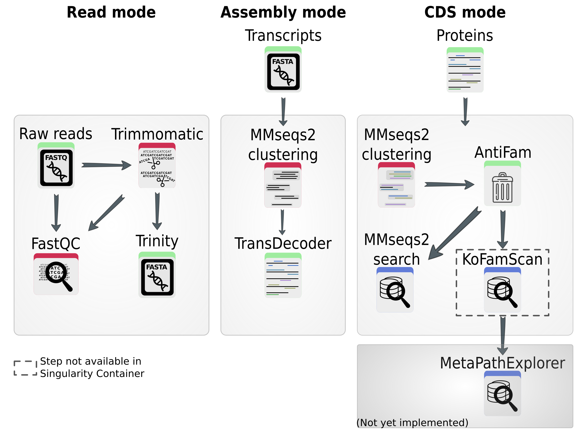

# KRYPTON

## Introduction

This package, _euKaRYote ProtisT fOnctionnal aNnotation of transcriptome_,
abbreviated as _KRYPTON_, written in Python, contains a pipeline for
transcriptome assembly and annotation (functional).  
KRYPTON combines Trinity, MMseqs2, and KOFamScan.

</img>

## Potential enhancements

Ideas of future enhancements

- [ ] run _KOFamScan_ within the pipeline, not after
- [ ] Taxonomic annotation
- [ ] Set _AntiFam_ non-necessary
- [ ] Generate a correspondance table after all clusterings

## Install, within a _Conda_ environment

1. Setup the environment

Here are the commands to build the environment. It was tested succefully on
a Linux 64bits system. I prefer [Mamba](https://github.com/mamba-org/mamba)
over the classic _Conda_, all commands below can be run with `conda` too.

```bash
mamba create -n krypton -c conda-forge -c bioconda "trinity>=2.9.1"
mamba activate krypton
mamba install -c conda-forge -c bioconda fastqc kofamscan mmseqs2 \
  hmmer "transdecoder==5.5.0" "trimmomatic>=0.39"
```

2. Download KRYPTON (no install)

First go in a directory to download the code, from _GitHub_

```bash
conda activate krypton

# Move the directory you want
cd ~/bioware  # This is an example!

# Download the code
git clone https://github.com/meb-team/KRYPTON.git

# Move in the KRYPTON's directory
cd KRYPTON
```

3. Data for [Antifam](https://xfam.wordpress.com/2012/03/21/introducing-antifam/):

These data are **mandatory** to run _KRYPTON_. If not present, the pipeline will
crash at some point. This dataset need about 40 MB of disk-space.

```bash
# Move in the directory to store AntiFam
cd krypton/ressources/
wget ftp://ftp.ebi.ac.uk/pub/databases/Pfam/AntiFam/current/Antifam.tar.gz
tar -zxf Antifam.tar.gz
rm relnotes version *.seed AntiFam_*.hmm Antifam.tar.gz
hmmpress AntiFam.hmm
cd ../..
```

4. Install KRYPTON

KRYPTON is built as a _Python3_ package, we will install it in the _Conda_
environment, with `pip`. , then

```bash
# Install KRYPTON and some Python packages
pip install . -r requirements.txt
```

4. Data for _KoFamScan_

This step is not required. There is the argument `--out` to specify a directory
in which to store both _KEGG_ files. Otherwise they are downloaded in the
current working directory

```bash
mkdir data

KRYPTON_download_K0famScan_data.py --out data
```

### On you system (not recommended)

_KRYPTON_ requires the following tools to be in your `$PATH` :

- Python >= 3.8
- numpy >= 1.22
- MMseqs2
- fastQC >= 0.11.4
- Trimmomatic >= 0.39
- Trinity >= 2.9.1
- Salmon >= v1.0.0
- TransDecoder == 5.5.0

## Usage

_KRYPTON_ can take different kinds of data as inpuy :

- sequencing _reads_ in `--mode reads`
- assembled transcripts in `--mode assembly`
- a set of proteins in `--mode cds`

A complete list of parameters is available with the command `KRYPTON.py -h`.

## Example

1. Basic example with the mode `reads`:

```bash
KRYPTON.py --out out_dir --r1 path/to/reads/read1.fq \
    --r2 path/to/reads/read2.fq
```

- Basic example with the mode `assembly`:

```bash
KRYPTON.py --mode assembly --transcripts path/to/transcripts.fa \
  --out out_dir
```

- Basic example with the mode `cds`:

```bash
python3 ./bin/KRYPTON.py --mode cds --cds path/to/protein.fa
```

### Results

For each step, the result are present under `<out_dir>` as follow:

- **Start of `read` mode**
  - `<out_dir>/00_fastqc_raw/`: results FastQC on the raw reads
  - `<out_dir>/01_trimmomatic/`: results of Trimmomatic
  - `<out_dir>/02_fastqc_trimmed/`: results of FastQC on the cleaned reads
  - `<out_dir>/03_trinity/`: Assembly of the reads
- **Start of `assembly` mode**
  - `<out_dir>/04_mmseqs/`: Clustering of the transcripts
  - `<out_dir>/05_transdecoder_longorfs/`: Predict the CDS from the transcripts
  - `<out_dir>/06_transdecoder_predict/`: Extract CDS that are most likely to code for a protein
- **Start of `cds` mode**
  - `<out_dir>/07_mmseqs/`: Clustering of the CDS
  - `<out_dir>/08_mmseq_search/`: Align the CDS (1 representative per cluster)
    against a reference database
  - `<out_dir>/09_ko_annot/`: KOFamScan results

<!-- ## Tips

### Run on HPC via a Singularity container

As TransDecoder.Predict outputs its results in the Current Working directory
(CWD) like it is not possible to pass it such information... I had to find a way
to move those files within the correct directory. So I adapted the KRYPTON's
code to use it within a Singularity container. To this mean, I added a
parameter, `--bindpoint` which informs KRYPTON about the path used
to link the host to the container.

In fact, TransDecoder.Predict write its results in `$HOME`, which is very weird
but the main author will not fix that as he moved to another position... So
I have to update the KRYPTON's code to handle this exception.

For the moment, formatting a MMseqs DB with KRYPTON running in a Singularity
container and saving it on CEPH server seems impossible... That is why
I let KRYPTON doing the formatting within the result directory and I copy
the database on CEPH after. -->
