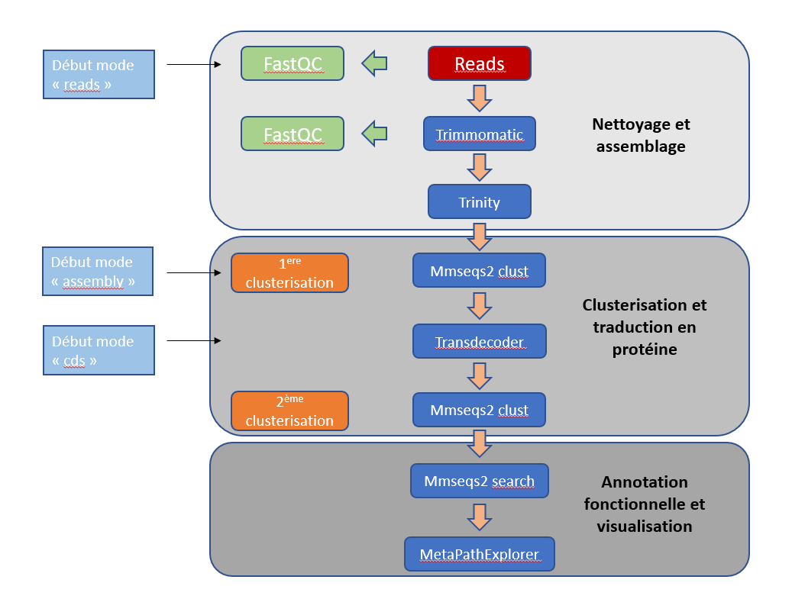

# KRYPTON

[](https://github.com/meb-team/CRYPTON)

## Introduction

This package, _euKaRYote ProtisT fOnctionnal aNnotation of transcriptome_,
abbreviated as _KRYPTON_, written in Python, contains a pipeline for
transcriptome assembly and annotation (functional and taxonomic).  
KRYPTON combines Trinity, MMseqs2, KOFamScan and MetaPathExplorer.

</img>

## To-do list:

- [ ] **TransDecoder-Predict** capture the log and check if it ends correctly
        otherwise, re-run it with the parameter **`--no_refine_starts`**.
- [ ] Clarify the 3 steps: use the right vocabulary, eg "_peptide sequence_"
    instead of "_cds_"
- [ ] add a `requirements.txt`
- [ ] check if a step ended nicely?
    - [ ] trimmomatic output the information in STDOUT/STDERR
        (_TrimmomaticPE: Completed successfully_)
    - [ ] Trinity too ("_All commands completed successfully. :-)_")
- [ ] Tweak tool parameters by passing them to the command line:
    - [x] fastQC _--threads_
    - [ ] trimmomatic _MINLEN:32 SLIDINGWINDOW:10:20 LEADING:5 TRAILING:5_
    - [X] trinity _--CPU_ and _--max_memory_
    - [ ] MMseqs2: cluster mode; sensitivity, min seq ID, ...
    - [x] TransDecoder --> min ORF size, <s>Pfam annotation?</s>
- [ ] Add a dict to store the subpath values
    - eg:
        - {"00" : "00_FastQC_raw",
        - "01" : "01_trimmomatic",
        - ... }
- <s>[x] Output the logs in `self.output/xxx_log.log`, **not** `self.output/xxx/xxx_log.log`</s> **BAD IDEA**
- <s>[x] Add the HMMER suite (TransDecoder?) + other step</s> **Not interesting**
- [x] **PRIORITY** Add [AntiFam](https://github.com/ebi-pf-team/antifam)
to filter out spurious proteins after the second MMseqs clustering.
    - Included in the installation step
- [ ] Add [Phytool](https://caninuzzo.shinyapps.io/phytool_v1/) ??
- [ ] Add [Tiara](10.1093/bioinformatics/btab672) for the identification of
Eukaryotic data (_a.k.a_ it can remove prokaryotic sequences??) and moreover it
is supposed to distinguish nuclear and organellar sequences.

- [ ] leave the possibility to the user to use the script `krypton/tasks/ko_annot.py`
    - Add arguments parser for this script!

<!-- ## Dependencies

- _All modes_
    - python >= 3.8
    - numpy >= 1.22
    - MMseqs2 v 10-6d92c

- _Mode reads_
    - fastQC >= 0.11.4
    - Trimmomatic >= 0.33
    - Trinity >= 2.9.1 and [Salmon](https://github.com/COMBINE-lab/salmon/releases/download/v1.0.0/Salmon-1.0.0_linux_x86_64.tar.gz) >= v1.0.0
        - I ran all my tests with **Trinity v2.9.1 which requires Salmon v1.0.0**
        - More recent version of Trinity may require Salmon > v1.0.0
        - The recipe for their [Docker image](https://hub.docker.com/r/trinityrnaseq/trinityrnaseq/tags) can help you choose the righ version of Salmon to use
        whether this information is not present in the Trinity's documentation.
    - [TransDecoder](https://github.com/TransDecoder/TransDecoder) >= 5.5.0

- _Mode assembly_
    - TransDecoder

- _Annotation_ -->
    <!-- - KOFamScan >= v1.3, available on [KEGG](https://www.genome.jp/tools/kofamkoala/)
    via _ftp_ or _html_, with the HMM profiles.
    - [MetaPathExplorer](https://github.com/meb-team/MetaPathExplorer), to display
    the KEGG annotation on KEGG metabolic pathways.
        - **Do not** download the _release_ available which cannot handle TSV matrix.
        Instead use `git clone https://github.com/meb-team/MetaPathExplorer`
        - **Important note**: All dependencies **except one** are available on
        Conda (See below to install). The module _Config::IniFiles_ must be
        installed via _CPAN_: `cpan install Config::IniFiles`. -->

## Install

### Setup the Conda environment

To fill the requirements linked to Python, a recipe for a **Conda environment**
is present in the file `ressources/krypton_conda_env.yml`.

To install it, make sure you have a [Conda](https://docs.conda.io/) installed
on your system and run:

```bash
conda env create -f ressources/krypton_conda_env.yml
conda activate krypton_base # Activate the Conda environment
```

Then, several tools are available if you cannot or do not want to update your system:

```bash
conda install fastqc trimmomatic=0.39 mmseqs2=13.45111  transdecoder=5.5.0

cpan install Config::IniFiles # For MetaPathExplorer
```

### Trinity

Unfortunately, _Trinity_ versions > 2.8.5 can't be installed in the same Conda
environment, so make sure it is available on your system.

### KRYPTON

```sh
# Move to the path where you wish to setup KRYPTON; Then
git clone https://github.com/meb-team/KRYPTON.git
cd KRYPTON
pip install -e .
```

### Other data

For [Antifam](https://xfam.wordpress.com/2012/03/21/introducing-antifam/):

```bash
cd ressources/
wget ftp://ftp.ebi.ac.uk/pub/databases/Pfam/AntiFam/current/Antifam.tar.gz
tar -zxf Antifam.tar.gz
rm relnotes version *.seed AntiFam_* Antifam.tar.gz
hmmpress AntiFam.hmm
```

#### KEGG data

The last step of KRYPTON requires some informations about KEGG. To get them,
runs:

```bash
python bin/download_KEGG_data.py
```

## Usage

There are several kind of usage. From the sequencing _reads_ (`--mode reads`), by
providing a set of transcripts (`--mode assembly`) or from a set of
**translated** CDS (`--mode cds`).

The help menu is available with the command `python bin/KRYPTON.py -h`, and bellow.

```text
usage: KRYPTON.py [-h] [--mode {reads,assembly,cds}] --out OUT_DIR
                  [--single-end] [--r1] [--r2] [--trimmomatic] [--transcripts]
                  [--min-protein-len] [--cds] [--bucket-in BUCKET_IN]
                  [--bucket-out BUCKET_OUT] [--run-on-HPC] [--mmseqs-annot]
                  [--mmseqs-db] [--mmseqs-db-path] [--kegg-ko] [--kegg-ko-ref]
                  [-t THREADS] [--mem MEM]

Run the pipeline KRYPTON, for transcriptome assembly and annotation

optional arguments:
  -h, --help            show this help message and exit

Mandatory arguments:
  --mode {reads,assembly,cds}
                        Pipeline mode, a.k.a the step from which the pipeline starts
  --out OUT_DIR         Prefix for the output directory

Mode - READS:
  From reads up to the annotation. Use the BASH  environment variable `TRINITY_HOME` to point the directory containing the executable for Trinity.

  --single-end          For Single-End reads, use this option and provide the dataset through `--r1`
  --r1                  The first read of the pair, in FASTQ (foo_R1.fq[.gz]).
  --r2                  The second read of the pair, in FASTQ (foo_R2.fq[.gz]).
  --trimmomatic         Path to the executable `trimmomatic-<version>.jar`

Mode - ASSEMBLY:
  --transcripts         File with ASSEMBLED TRANSCRIPTS, in FASTA (foo.fa[.gz])
  --min-protein-len     Minimal protein length for TransDecoder.LongOrfs. Default is 100 AA

Mode - CDS:
  --cds                 File with TRANSLATED CDS, in FASTA (foo.fa[.gz])

KRYPTON run on HPC:
  --bucket-in BUCKET_IN
                        Name of the bucket used to read data from. This option is required to run KRYPTON on the HPC2 cluster
  --bucket-out BUCKET_OUT
                        Name of the bucket used to store data in. This option is required to run KRYPTON on the HPC2 cluster
  --run-on-HPC          Turn on this option when KRYPTON is meant to be run on a HPC cluster -- WIP

MMseqs2 options:
  --mmseqs-annot        Turn ON the annotation with MMseqs2 and a database.
  --mmseqs-db           The name of a database provided by MMseqs2 (a list is present at https://github.com/soedinglab/MMseqs2/wiki#downloading-databases)
                        **OR**
                        Path to a fa,fasta,fq,fastq,pep[.gz] file.
                        #####
                        Default:
                        	- the database is setup within the output directory. To store the database elsewhere on the disk, provide a path with `--mmseqs-db-path`
                        	- If nothing is provided, KRYPTON uses UniProtKB/Swiss-Prot
  --mmseqs-db-path      Path to an existing database
                        **OR**
                        Path to a directory to store the database passed to `--mmseqs-db`

KO annotation:
  --kegg-ko             Turn ON KEGG annotation for the proteins, and visualise the results with MetaPathExplorer
                        This turns OFF the
  --kegg-ko-ref         PATH to `ko_list` & `profiles` (dezipped) -- MANDATORY to run KofamScan.
                        Download them BEFORE running KRYPTON, at
                        	https://www.genome.jp/ftp/db/kofam/ko_list.gz
                        and	https://www.genome.jp/ftp/db/kofam/profiles.tar.gz

General options:
  -t THREADS            Maximum number of threads that KRYPTON can use.
  --mem MEM             Maximum amount of RAM - in GB - that KRYPTON can use, eg 64 to ask for 64GB of RAM
```

### Example

1. Basic example with the mode `reads`:

```bash
python3 bin/KRYPTON.py --out out_dir --r1 path/to/reads/read1.fq \
    --r2 path/to/reads/read2.fq
```

- Basic example with the mode `assembly`:

```bash
python3 bin/KRYPTON.py --mode assembly --transcripts path/to/transcripts/infile.fa[.gz] --out out_dir
```

- Basic example with the mode `cds`:

```bash
python3 ./bin/KRYPTON.py --mode cds --cds path/to/predicted/cds/infile.fa
```

### Results

For each step, the result are present under `<out_dir>` as follow:
- **Start of `read` mode**
    - `<out_dir>/00_fastqc_raw/`: results FastQC on the raw reads
    - `<out_dir>/01_trimmomatic/`: results of Trimmomatic
    - `<out_dir>/02_fastqc_trimmed/`: results of FastQC on the cleaned reads
    - `<out_dir>/03_trinity/`: Assembly of the reads
- **Start of `assembly` mode**
    - `<out_dir>/04_mmseqs/`: Clustering of the transcripts
    - `<out_dir>/05_transdecoder_longorfs/`: Predict the CDS from the transcripts
    - `<out_dir>/06_transdecoder_predict/`: Extract CDS that are most likely to code for a protein
- **Start of `cds` mode**
- `<out_dir>/07_mmseqs/`: Clustering of the CDS
- `<out_dir>/08_mmseq_search/`: Align the CDS (1 representative per cluster)
against a reference database
- `<out_dir>/09_ko_annot/`: KOFamScan results
- `<out_dir>/10_MetaPathExplorer/`: MetaPathExplorer results


<!--
Les résultats de l'annotation fonctionnelle se trouvent dans le dossier :


```sh
/chemin/absolu/dossier_output/mmseqs2_out/results_out/
```

Le lien entre les Ko et les map se trouvent :

```sh
/chemin/absolu/dossier_output/mmseqs2_out/results_out/alignment_trinity_ko_map.tsv
```

Le lien entre les Ko et l'Orthologie de la séquence se trouvent :

```sh
/chemin/absolu/dossier_output/mmseqs2_out/results_out/alignment_trinity_ko_ortho.tsv
```

Le résultats de l'alignement de l'assemblage Trinity avec Uniref90 :

```sh
/chemin/absolu/dossier_output/mmseqs2_out/results_out/alignment_trinity_Uniref90_sorted.tsv
```

Pour visualisé les résultats via MetaPathExplorer :

```sh
/chemin/absolu/dossier_output/mmseqs2_out/results_out/MetaPAthExplorer/
```

### Jeu de données test

Un jeu de donné test est fourni dans le dossier : File_test.
Ce jeu de donné provient du projet MMETSP ré-assemblé par L. Johnson _et al._, 2018 (https://academic.oup.com/gigascience/article/8/4/giy158/5241890)
téléchargé sur : https://zenodo.org/record/1212585


### Commentaires :


Il peut avoir un problème avec MetaPathExplorer si la base de donnée utilisé par MetaPathExplorer n'est pas à jour, à surveiller. -->
