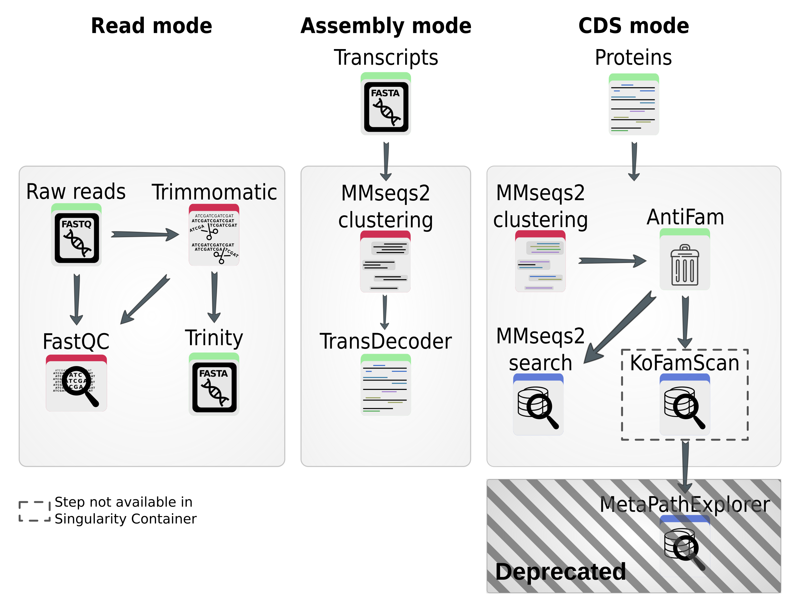

# KRYPTON

## Introduction

This package, _euKaRYote ProtisT fOnctionnal aNnotation of transcriptome_,
abbreviated as _KRYPTON_, written in Python, contains a pipeline for
transcriptome assembly and annotation (functional and taxonomic).  
KRYPTON combines Trinity, MMseqs2, KOFamScan and MetaPathExplorer.

</img>

<!-- ## Dependencies

- _All modes_
    - python >= 3.8
    - numpy >= 1.22
    - MMseqs2 v 10-6d92c

- _Mode reads_
    - fastQC >= 0.11.4
    - Trimmomatic >= 0.33
    - Trinity >= 2.9.1 and [Salmon](https://github.com/COMBINE-lab/salmon/releases/download/v1.0.0/Salmon-1.0.0_linux_x86_64.tar.gz) >= v1.0.0
        - I ran all my tests with **Trinity v2.9.1 which requires Salmon v1.0.0**
        - More recent version of Trinity may require Salmon > v1.0.0
        - The recipe for their [Docker image](https://hub.docker.com/r/trinityrnaseq/trinityrnaseq/tags) can help you choose the righ version of Salmon to use
        whether this information is not present in the Trinity's documentation.
    - [TransDecoder](https://github.com/TransDecoder/TransDecoder) >= 5.5.0

- _Mode assembly_
    - TransDecoder

- _Annotation_
    - KOFamScan >= v1.3, available on [KEGG](https://www.genome.jp/tools/kofamkoala/)
    via _ftp_ or _html_, with the HMM profiles.
    - [MetaPathExplorer](https://github.com/meb-team/MetaPathExplorer), to display
    the KEGG annotation on KEGG metabolic pathways.
        - **Do not** download the _release_ available which cannot handle TSV matrix.
        Instead use `git clone https://github.com/meb-team/MetaPathExplorer`
        - **Important note**: All dependencies **except one** are available on
        Conda (See below to install). The module _Config::IniFiles_ must be
        installed via _CPAN_: `cpan install Config::IniFiles`. -->

## Putative enhancements

Ideas of future enhancements

- [ ] Set _AntiFam_ non-necessary
- [ ] Generate a correspondance table after all clusterings

## Install, within a _Conda_ environment

1. Setup the environment

Here are the commands to build the environment. It was tested succefully on
a Linux 64bits system. I prefer [Mamba](https://github.com/mamba-org/mamba)
over the classic _Conda_, all commands below can be run with `conda` too.

```bash
mamba create -n krypton -c conda-forge -c bioconda "trinity>=2.9.1"
mamba activate krypton
mamba install -c conda-forge -c bioconda fastqc kofamscan mmseqs2 \
  hmmer "transdecoder==5.5.0"
```

2. Download KRYPTON (no install)

First go in a directory to download the code, from _GitHub_

```bash
conda activate krypton

# Move the directory you want
cd ~/bioware  # This is an example!

# Download the code
git clone https://github.com/meb-team/KRYPTON.git

# Move in the KRYPTON's directory
cd KRYPTON
```

3. Data for [Antifam](https://xfam.wordpress.com/2012/03/21/introducing-antifam/):

These data are **mandatory** to run _KRYPTON_. If not present, the pipeline will
crash at some point. This dataset need about 40 MB of disk-space.

```bash
# Move in the directory to store AntiFam
cd krypton/ressources/
wget ftp://ftp.ebi.ac.uk/pub/databases/Pfam/AntiFam/current/Antifam.tar.gz
tar -zxf Antifam.tar.gz
rm relnotes version *.seed AntiFam_*.hmm Antifam.tar.gz
hmmpress AntiFam.hmm
cd ../..
```

4. Install KRYPTON

KRYPTON is built as a _Python3_ package, we will install it in the _Conda_
environment, with `pip`. , then

```bash
# Install it
pip install -e .
```

4. Data for _KoFamScan_

```bash
python KRYPTON_download_K0famScan_data.py
```

### On you system (not recommended)

**- WIP -**

## Usage

There are several kind of usage. From the sequencing _reads_ (`--mode reads`), by
providing a set of transcripts (`--mode assembly`) or from a set of
**translated** CDS (`--mode cds`).

The help menu is available with the command `python bin/KRYPTON.py -h`.

## Example

1. Basic example with the mode `reads`:

```bash
python3 bin/KRYPTON.py --out out_dir --r1 path/to/reads/read1.fq \
    --r2 path/to/reads/read2.fq
```

- Basic example with the mode `assembly`:

```bash
python3 bin/KRYPTON.py --mode assembly --transcripts path/to/transcripts/infile.fa[.gz] --out out_dir
```

- Basic example with the mode `cds`:

```bash
python3 ./bin/KRYPTON.py --mode cds --cds path/to/predicted/cds/infile.fa
```

### Results

For each step, the result are present under `<out_dir>` as follow:

- **Start of `read` mode**
  - `<out_dir>/00_fastqc_raw/`: results FastQC on the raw reads
  - `<out_dir>/01_trimmomatic/`: results of Trimmomatic
  - `<out_dir>/02_fastqc_trimmed/`: results of FastQC on the cleaned reads
  - `<out_dir>/03_trinity/`: Assembly of the reads
- **Start of `assembly` mode**
  - `<out_dir>/04_mmseqs/`: Clustering of the transcripts
  - `<out_dir>/05_transdecoder_longorfs/`: Predict the CDS from the transcripts
  - `<out_dir>/06_transdecoder_predict/`: Extract CDS that are most likely to code for a protein
- **Start of `cds` mode**
  - `<out_dir>/07_mmseqs/`: Clustering of the CDS
  - `<out_dir>/08_mmseq_search/`: Align the CDS (1 representative per cluster)
    against a reference database
  - `<out_dir>/09_ko_annot/`: KOFamScan results
  - `<out_dir>/10_MetaPathExplorer/`: MetaPathExplorer results

## Tips

### Run on HPC via a Singularity container

As TransDecoder.Predict outputs its results in the Current Working directory
(CWD) like it is not possible to pass it such information... I had to find a way
to move those files within the correct directory. So I adapted the KRYPTON's
code to use it within a Singularity container. To this mean, I added a
parameter, `--bindpoint` which informs KRYPTON about the path used
to link the host to the container.

In fact, TransDecoder.Predict write its results in `$HOME`, which is very weird
but the main author will not fix that as he moved to another position... So
I have to update the KRYPTON's code to handle this exception.

For the moment, formatting a MMseqs DB with KRYPTON running in a Singularity
container and saving it on CEPH server seems impossible... That is why
I let KRYPTON doing the formatting within the result directory and I copy
the database on CEPH after.
